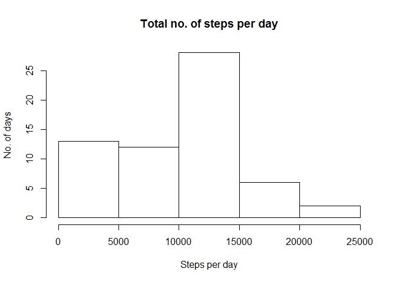
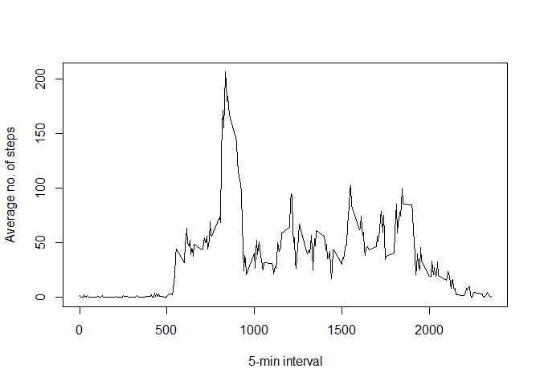
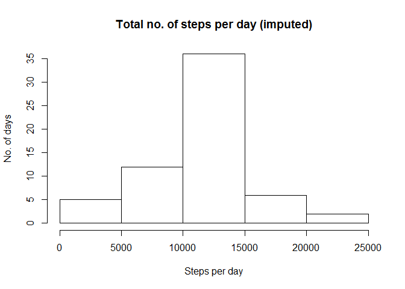
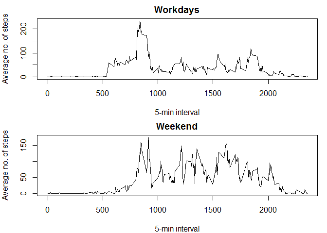

# Reproducible Research: Peer Assessment 1

## Loading and preprocessing the data
First the working directory should be set to the directory this Rmd file is stored in (using `setwd()`). Next we load a required package (`dplyr`), unpack the compressed data and read it into memory (using `read.csv`). No preprocessing of data is necessary.


```r
library(dplyr)
```

```
## 
## Attaching package: 'dplyr'
## 
## The following object is masked from 'package:stats':
## 
##     filter
## 
## The following objects are masked from 'package:base':
## 
##     intersect, setdiff, setequal, union
```

```r
unzip(zipfile="activity.zip")
dataset <- read.csv("activity.csv", header=TRUE, sep=",")
```

## What is mean total number of steps taken per day?
We calculate the total number of steps taken per day and plot a histogram:

```r
dailysteps <- tapply(dataset$steps, dataset$date, sum, na.rm = TRUE) 
hist(dailysteps, main = "Total no. of steps per day", xlab = "Steps per day", ylab="No. of days")
```

 

Next we calculate the mean and median of the total number of steps taken per day:

```r
round(mean(dailysteps))
```

```
## [1] 9354
```

```r
round(median(dailysteps))
```

```
## [1] 10395
```

## What is the average daily activity pattern?
We make a time series plot of the 5-minute interval (x-axis) and the average number of steps taken, averaged across all days (y-axis):


```r
dailyactivity <- tapply(dataset$steps, dataset$interval, mean, na.rm = TRUE)
plot(dailyactivity ~ unique(dataset$interval), type="l", xlab="5-min interval", ylab="Average no. of steps")
```

 

Next we calculate which 5-minute interval, on average across all the days in the dataset, contains the maximum number of steps:

```r
dailyactivity[which(dailyactivity == max(dailyactivity))]
```

```
##      835 
## 206.1698
```
The answer is interval 835 (= 08:35 am) has the maximum average number of steps (206.2).

## Imputing missing values
First we calculate and report the total number of missing values (coded as NA) in the dataset, as well as their percentage:

```r
sum(!complete.cases(dataset$steps))
```

```
## [1] 2304
```

```r
dim(dataset)[1]
```

```
## [1] 17568
```

```r
sum(!complete.cases(dataset$steps))/dim(dataset)[1]
```

```
## [1] 0.1311475
```

There are 2304 missing values in 17568 observations (13.1%), clearly too much to ignore, so we need to decide on the strategy how to impute the missing values. To keep things simple, for each NA we will use the mean for that particular 5-minute interval across all days.

First we create a new dataset, equal to the original dataset but with the missing data filled in:

```r
new_dataset <- transform(dataset, steps = ifelse(is.na(steps), dailyactivity, steps))
new_dailysteps <- tapply(new_dataset$steps, new_dataset$date, sum) 
```

Then we produce a histogram of the total number of steps taken each day:

```r
hist(new_dailysteps, main = "Total no. of steps per day (imputed)", xlab = "Steps per day", ylab="No. of days")
```

 

and calculate the mean and median total number of steps taken per day:

```r
mean(new_dailysteps)
```

```
## [1] 10766.19
```

```r
median(new_dailysteps)
```

```
## [1] 10766.19
```

### Do these values differ from the estimates from the first part of the assignment?
Both mean and median are quite close to what they were before the NA were substituted by average values, the median more so than the mean (mean 10766; median 10766 as opposed to 9354 and 10395).

### What is the impact of imputing missing data on the estimates of the total daily number of steps?
The early intervals (hours of the day) figure less prominently than before and the histogram has become more concentrated towards the mean.

### Are there differences in activity patterns between weekdays and weekends?
To answer this question we create a new dataset (including the filled-in data) and devide it into data for workdays and weekends:


```r
new_dataset <- dataset
new_dailysteps <- tapply(new_dataset$steps, new_dataset$date, sum, na.rm = FALSE) 
new_dataset$weekday <- weekdays(as.Date(new_dataset$date)) #new variable
weekend_data <- subset(new_dataset, new_dataset$weekday == "Sunday" | new_dataset$weekday == "Saturday")
workday_data <- subset(new_dataset, !(new_dataset$weekday == "Sunday" | new_dataset$weekday == "Saturday"))
weekend_activity <- tapply(weekend_data$steps, weekend_data$interval, mean, na.rm = TRUE)
workday_activity <- tapply(workday_data$steps, workday_data$interval, mean, na.rm = TRUE)
```

This data can then be plotted separately for workdays and weekends:

```r
par(mfrow = c(2,1), mar = c(4,4,2,1))
plot(workday_activity ~ unique(new_dataset$interval), type="l", main="Workdays", xlab="5-min interval", ylab="Average no. of steps")
plot(weekend_activity ~ unique(new_dataset$interval), type="l", main="Weekend", xlab="5-min interval", ylab="Average no. of steps")
```

 

As we see, the patterns differ substantially between workdays end weekends. Whereas during the week most steps are taken in rush hour between 8am and 9am and activity is relatively restrained during working hours (especially between 9am and 5pm), over the weekend period activity is more equally distributed across the day (8am-8pm) and early activity (<8am) significantly lower than on weekdays.
